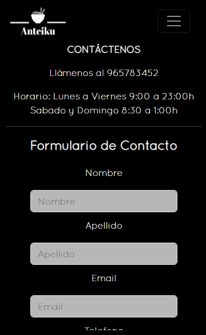

# CARTA RESTAURANTE ANTEIKU

## CONTENIDO
   
* Introducción
* Requisitos
* Tecnologías utilizadas
* Componentes utilizados y modificados
* Posibles problemas
* Autores
* Licencias

### INTRODUCCIÓN

Este proyecto requería la creación de un sitio web responsive de un local con su correspondiente presentación,  carta de platos y sitio de contacto.
En este caso yo he realizado una carta de un restaurante de Ramen llamado Anteiku, un lugar ubicado en el centro de Madrid donde podrá degustar uno de los mejores Ramen de España. Estructurada en 3 ventanas diferentes que a continuación paso a explicar.

* Se ha estructurado de la siguiente manera:
    - Una ventana principal donde podrá ver una descripción del lugar, un menú de navegación y un apartado de redes sociales.  

    
 

    - Una ventana de la carta del restaurante donde podrá ver los diferentes tipos de Ramen que se sirven en el establecimiento con sus respectivos nombres, imagen, descripción y precios. Además dispondrá también de un menú de navegación y apartado de redes sociales.

     
    
    

    - Una ventana de contacto donde podrá ver las diferentes maneras de ponerse en contacto con el restaurante (Telefóno, horario, mapa). Además de un formulario de contacto. También dispondrá de un menú de navegación y el apartado de redes sociales.

    
    

### REQUISITOS

* Los requisitos para el uso de este proyecto son los siguientes:
* Un dispotivo, como por ejemplo: móvil, tablet, ordenador..
* Conexión a internet
* Un navegador (Google Chrome, Mozilla Firefox, Opera...)

### TECNOLOGÍAS UTILIZADAS

* Este proyecto se ha realizado utlizando:
    - VsCode: como editor de texto
    - Google Chrome: para la comprobación del funcionamiento utilizando las herramientas de desarrollador
    - HTML5
    - CSS3
    - BOOTSTRAP 5
    - GITHUB para el control de versiones y guardado del proyecto
    - Markdown filter para la elaboración del Readme

### COMPONENTES UTLIZADOS Y MODIFICADOS
 
* Los componentes principales utilizados y modificados son:

    - Contenedores principales subdivididos en rows y a su vez en columnas modificados para su correcta adaptación responsive.
    - Navbar propio de bootstrap modificado acorde al restaurante.
    - Cards propias de bootstrap para los platos modificados para contener una imagen y texto.
    - Formulario de contacto propio de bootstrap y un iframe de un mapa del sitio con Google Maps.
    

### POSIBLES PROBLEMAS

En la versión actual del proyecto no se han encontrado posibles problemas.
Si existe algún problema, o usted como usuario detecta alguno, póngase en contacto con el autor de este. Lo encontrará en la sección de autoría más abajo.

### AUTORES

Autores actuales:

* Jordi Jericó López - https://www.linkedin.com/in/jordi-jerico-lopez-15950918a/

### LICENCIAS

* MIT License
* Copyright (c) 2023 Jordi Jerico